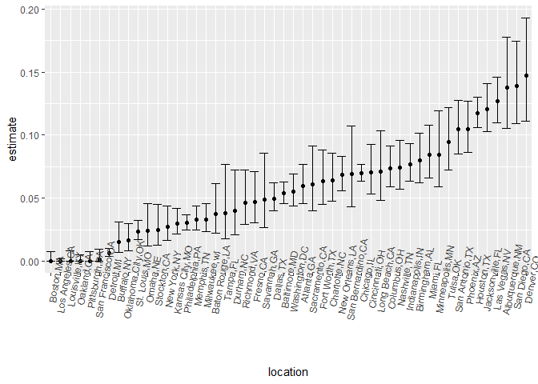

P8105_HW5_LJ2607
================
Li Jiang
2024-11-16

``` r
#load required packages
library(tidyverse)
```

    ## ── Attaching core tidyverse packages ──────────────────────── tidyverse 2.0.0 ──
    ## ✔ dplyr     1.1.4     ✔ readr     2.1.5
    ## ✔ forcats   1.0.0     ✔ stringr   1.5.1
    ## ✔ ggplot2   3.5.1     ✔ tibble    3.2.1
    ## ✔ lubridate 1.9.3     ✔ tidyr     1.3.1
    ## ✔ purrr     1.0.2     
    ## ── Conflicts ────────────────────────────────────────── tidyverse_conflicts() ──
    ## ✖ dplyr::filter() masks stats::filter()
    ## ✖ dplyr::lag()    masks stats::lag()
    ## ℹ Use the conflicted package (<http://conflicted.r-lib.org/>) to force all conflicts to become errors

``` r
library(ggplot2)

library(rvest)
```

    ## 
    ## Attaching package: 'rvest'
    ## 
    ## The following object is masked from 'package:readr':
    ## 
    ##     guess_encoding

``` r
library(purrr)
library(broom)
set.seed(1) 
```

\#Problem2

``` r
# Simulation parameters
n <- 30
sigma <- 5
mu_values <- 0:6

# Create simulation data frame
simulation_results <- data.frame()
for (current_mu in mu_values) {
  for (iteration in 1:5000) {
    simulated_data <- rnorm(n, mean = current_mu, sd = sigma)
    test_outcome <- broom::tidy(t.test(simulated_data, mu = 0))
    simulation_results <- rbind(simulation_results, 
                                 c(current_mu, mean(simulated_data),test_outcome$p.value, test_outcome$p.value < 0.05))
  }
}

# Assign column names
colnames(simulation_results) <- c("mu", "mu_hat", "p_value", "reject_null")
```

``` r
#plot showing the power of the test and the true value of μ
rejection_proportions <- aggregate(reject_null ~ mu, data = simulation_results, mean)

ggplot(rejection_proportions, aes(x = mu, y = reject_null)) +
  geom_line() +
  geom_point() +
  labs(title = "Proportion of Null Rejection vs. True Value of mu",
       x = "True Value of mu",
       y = "Proportion of Null Rejected") +
  theme_minimal()
```

<!-- -->

\*Description: From this plot, we observe that as mu increases, the
proportion of null hypotheses rejected also rises. This indicates that
larger effect sizes lead to higher testing power for detecting the
effect. When the effect size becomes sufficiently large, the proportion
of null rejections approaches 1.

``` r
# Calculate average estimates
average_estimates <- aggregate(mu_hat ~ mu, data = simulation_results, mean)
average_estimates_rejected <- aggregate(mu_hat ~ mu, data = simulation_results[simulation_results$reject_null == TRUE, ], mean)

# Add group labels
average_estimates$group <- "average_estimates"
average_estimates_rejected$group <- "average_estimates_rejected"

# Combine data frames
combined_data <- rbind(average_estimates, average_estimates_rejected)

# Plot the results
ggplot(combined_data, aes(x = mu, y = mu_hat, color = group)) +
  geom_line() +
  geom_point() +
  labs(title = "Average Estimate of mu_hat vs. True Value of mu",
       x = "True Value of mu",
       y = "Average Estimate of mu_hat") +
  theme_minimal()
```

<!-- -->
\*Conclusion:The sample average of mu_hat for tests where the null is
rejected is generally not equal to the true value of mu.It tends to be
higher, particularly when mu is small, leading to an overestimation of
the true effect size. However, as the effect size increases, the sample
estimates align more closely with the true values.

\##Problem 3

``` r
#read data
homicide_data <- read_csv("data/homicide-data.csv")
```

    ## Rows: 52179 Columns: 12
    ## ── Column specification ────────────────────────────────────────────────────────
    ## Delimiter: ","
    ## chr (9): uid, victim_last, victim_first, victim_race, victim_age, victim_sex...
    ## dbl (3): reported_date, lat, lon
    ## 
    ## ℹ Use `spec()` to retrieve the full column specification for this data.
    ## ℹ Specify the column types or set `show_col_types = FALSE` to quiet this message.

``` r
homicide_data <- homicide_data %>% mutate(location = paste(city, state, sep = ","))
```

``` r
# Summarize homicides by location
summary_by_location <- 
  group_by(homicide_data, location) %>%
  summarize(
    total_cases = n(),
    unresolved_cases = length(which(disposition == "Closed without arrest" | disposition == "Open/no arrest"))
  ) %>%
  filter(location != "Tulsa,AL")
summary(summary_by_location)
```

    ##    location          total_cases     unresolved_cases
    ##  Length:50          Min.   : 208.0   Min.   :  0.00  
    ##  Class :character   1st Qu.: 448.2   1st Qu.: 13.00  
    ##  Mode  :character   Median : 690.5   Median : 38.50  
    ##                     Mean   :1043.6   Mean   : 58.44  
    ##                     3rd Qu.:1289.0   3rd Qu.: 71.50  
    ##                     Max.   :5535.0   Max.   :387.00

``` r
# homicide data for Baltimore
baltimore_summary <- filter(summary_by_location, location == "Baltimore,MD")
summary(baltimore_summary)
```

    ##    location          total_cases   unresolved_cases
    ##  Length:1           Min.   :2827   Min.   :152     
    ##  Class :character   1st Qu.:2827   1st Qu.:152     
    ##  Mode  :character   Median :2827   Median :152     
    ##                     Mean   :2827   Mean   :152     
    ##                     3rd Qu.:2827   3rd Qu.:152     
    ##                     Max.   :2827   Max.   :152

Description:The dataset contains information on 50 locations with
variables for total_cases and unresolved_cases. The total number of
cases ranges from 208 to 5535, with an average of 1043.6 and a median of
690.5. Most locations have total cases clustered between the 25th
percentile (448.2) and the 75th percentile (1289.0). Unresolved cases
range from 0 to 387, with an average of 58.44 and a median of 38.5. The
majority of unresolved cases fall between 13.0 (25th percentile) and
71.5 (75th percentile). The data reveals variability across locations,
with some experiencing significantly higher total and unresolved cases
than others.

``` r
# Proportion test for Baltimore
baltimore_prop_test <- prop.test(baltimore_summary[['unresolved_cases']], baltimore_summary[['total_cases']]) %>% 
  broom::tidy()
```

``` r
# Loop to calculate proportions for all locations
tidy_summary <- data.frame()
for (current_location in summary_by_location$location) {
  temp_summary <- filter(summary_by_location, location == current_location)
  temp_test <- merge(
    temp_summary, 
    select(
      prop.test(temp_summary[['unresolved_cases']], temp_summary[['total_cases']]) %>% 
        broom::tidy(), 
      c('estimate', 'conf.low', 'conf.high')
    ))
  tidy_summary <- rbind(tidy_summary, temp_test)
}
```

``` r
# Plotting the results
tidy_summary %>%
  mutate(location = fct_reorder(location, estimate)) %>%
  ggplot(aes(x = location, y = estimate)) +
  geom_point() +
  geom_errorbar(aes(ymin = conf.low, ymax = conf.high)) +
  theme(axis.text.x = element_text(angle = 80))
```

<!-- -->
